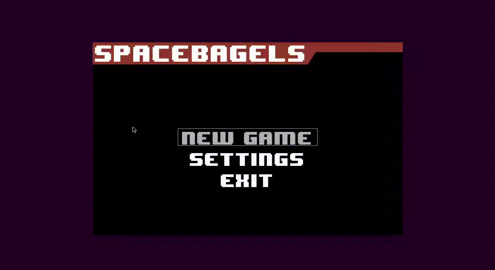

# SpaceBagels

A two-person arcade shooter in pygame

You have met your arch enemy
in the outskirts of a desolate galaxy,
on the edge of an event horizon.
Even though you cannot reach out to each other,
the two of you embrace
for an epic laser-weapon showdown.
But beware: With all the weird physics so close
to a black hole, you might encounter all sorts
of objects helping or damaging your cause.

## Why is it called SpaceBagels?

Do you really want to know? Go ahead and find out. ;)

## Installation

You need at least Python 3.6 to run SpaceBagels.
Also, your need to install PyGame on your system
(e.g. for Debian `sudo apt-get install python3-pygame`).

To install the game you can download
one of the release packages or check out
this repository. Then run pip in the target directory, e.g.

    pip3 install --user .

To start the game invoke Main.py:

    python3 src/Main.py
